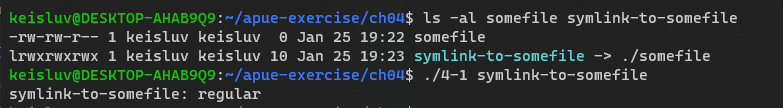
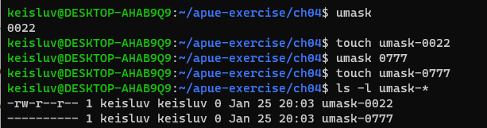
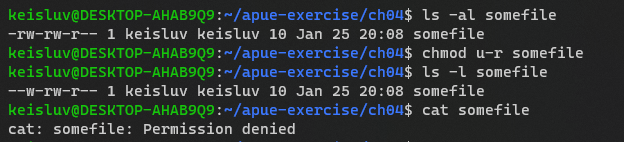
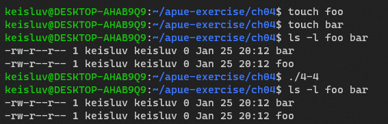
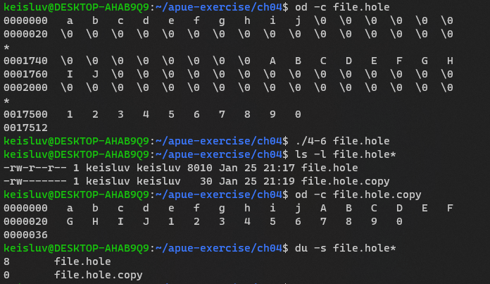

# Chapter 4. File and Directory


## 4-1

### Q. 

Modify the program in Figure 4.3 to use stat instead of lstat. What changes if one of the
command-line arguments is a symbolic link?

### A. 



If argument is symbolic link, this program using `stat` instead of `lstat` gives the file stat which is pointed by symlink file.


---

## 4-2

### Q

What happens if the file mode creation mask is set to 777 (octal)? Verify the results using your shell’s umask command.

### A



Noone has permission to umask-0777 file.

---

## 4-3

### Q 

Verify that turning off user-read permission for a file that you own denies your access to the file.

### A



Permission denied.

---

## 4-4

### Q

Run the program in Figure 4.9 after creating the files `foo` and `bar`. What happens?

### A



`creat` function actually do not create a file..

---

## 4-5

### Q

In Section 4.12, we said that a file size of 0 is valid for a regular file.
We also said that the `st_size` field is defined for directories and symbolic links.
Should we ever see a file size of 0 for a directory or a symbolic link?

### A

Directory usually have multiple of 16 or 512 bytes file size.. it cannot be 0.

Symbolic link have the size of linked file name size.. if file size is 0, this means linked file name's length is zero. 
This cannot be possible, so sym-link file size cannot be 0.

---

## 4-6

### Q

Write a utility like cp(1) that copies a file containing holes, without writing the bytes of 0 to the output file.


### A




Before `write` call, just count the byte which is not empty(!= '\0')..
And rewrite the buffer for non-0 bytes. 

And call `write` with not-0 bytes buf and the number of byte, `n`.

---

## 4-7

### Q

Note in the output from the `ls` command in Section 4.12 that the files `core` and `core.copy` have different access permissions.
If the umask value didn’t change between the creation of the two files, explain how the difference could have occurred.

```bash
$ cat core > core.copy
$ ls -l core*
-rw-r--r-- 1 sar 8483248 Nov 18 12:18 core
-rw-rw-r-- 1 sar 8483248 Nov 18 12:27 core.copy
$ du -s core*
272     core
16592   core.copy
```

### A


Probably shell stdout redirection create the file with `rw-rw-r--` permission.
It could be implemented like `creat("core.copy", (S_IRUSR | S_IWUSR | S_IRGRP | S_IWGRP | S_IROTH))`.


---

## 4-8

### Q

When running the program in Figure 4.16, we check the available disk space with the `df(1)` command. 
Why didn’t we use the `du(1)` command?

```C
#include "apue.h"
#include <fcntl.h>
int
main(void)
{
    if (open("tempfile", O_RDWR) < 0)
        err_sys("open error");
    if (unlink("tempfile") < 0)
        err_sys("unlink error");
    printf("file unlinked\n");
    sleep(15);
    printf("done\n");
    exit(0);
}
```

```bash
$ ls -l tempfile            // look at how big the file is
-rw-r----- 1 sar 413265408 Jan 21 07:14 tempfile
$ df /home                  // check how much free space is available
Filesystem  1K-blocks   Used    Available   Use%    Mounted on
/dev/hda4   11021440    1956332 9065108     18%     /home
$ ./a.out &                 // run the program in Figure 4.16 in the background
1364                        // the shell prints its process ID
file unlinked               // the file is unlinked
$ ls -l tempfile            // see if the filename is still there
ls: tempfile: No such file or directory 
                            // the directory entry is gone
$ df /home                  // see if the space is available yet
Filesystem  1K-blocks   Used    Available   Use%    Mounted on
/dev/hda4   11021440    1956332 9065108     18%     /home
done the program is done, all open files are closed
$ df /home                  // now the disk space should be available
Filesystem  1K-blocks   Used    Available   Use%    Mounted on
/dev/hda4   11021440    1552352 9469088     15%     /home
                            // now the 394.1 MB of disk space are available
```


### A

1. `du(1)` estimate file space usage.. maybe it count link number and use the file's size to calculate.
2. `df(1)` estimate available disk space of file system.. it doesn't use link number.

So, when above program unlink, using `du(1)` would immediately except the unlinked file.. but, using `df(1)`, after kernel deleted the file the command would show different result.


**ref**
1. [ref.1](https://kb.netapp.com/Advice_and_Troubleshooting/Data_Storage_Systems/FAS_Systems/Why_the_result_of_linux_commands_%22df%22_and_%22du%22_are_different_after_deleting_file)
2. `du(1)`, `df(1)` man page


---

## 4-9

### Q

In Figure 4.20, we show the `unlink` function as modifying the changed-status time of the file itself.
How can this happen?

### A

Link counts is in i-node.
`unlink` change link count, so it change changed-status time(`ctime`).


---

## 4-10

### Q

In Section 4.22, how does the system’s limit on the number of open files affect the `myftw` function?

### A

I don't know...

---

## 4-11

### Q

In Section 4.22, our version of ftw never changes its directory.
Modify this routine so that each time it encounters a directory, it uses the chdir function to change to that directory, allowing it to use the filename and not the pathname for each call to lstat. 
When all the entries in a directory have been processed, execute chdir(".."). 
Compare the time used by this version and the version in the text.

### A


---

## 4-

### Q

### A


---

## 4-

### Q

### A


---

## 4-

### Q

### A


---

## 4-

### Q

### A


---

## 4-

### Q

### A


