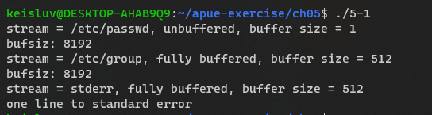
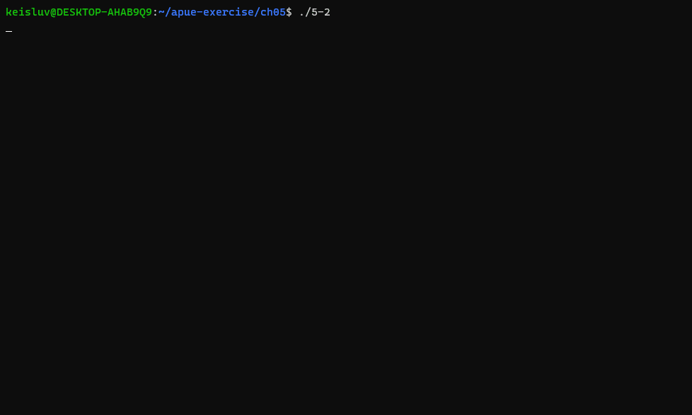

# Chapter 5. Standard I/O Library


## 5-1

### Q. 

Implement `setbuf` using `setvbuf`.

### A. 



---


## 5-2

### Q. 

Type in the program that copies a file using line-at-a-time I/O (fgets and fputs) from Figure 5.5, but use a MAXLINE of 4.
What happens if you copy lines that exceed this length?
Explain what is happening.

### A. 



It just works well.

That's because `fgets` just get input until `\n` comes in: if buffer is full, the next `fgets` call just get next characters.
Also, `fputs` prints the buffer, but it print `\n` when the input line end printed.

---


## 5-3

### Q. 

What does a return value of 0 from `printf` mean?

### A. 

```C
#include "apue.h"

int main(void)
{
    int out, i;
    out = printf("", i);
    printf("return value of first printf() call : %d\n", out);

    exit(0);
}
```

```bash
keisluv@DESKTOP-AHAB9Q9:~/apue-exercise/ch05$ ./5-3
return value of first printf() call : 0
```

Return value 0 of `printf` call means that call doesn't print any character byte.

---


## 5-4

### Q. 

The following code works correctly on some machines, but not on others. 
What could be the problem?

```C
#include <stdio.h>

int main(void)
{
    char c;
    while ((c = getchar()) != EOF)
        putchar(c);
}
```

### A. 

`getchar()` return value type is `int`.
But, `char` type is unsigned, so if `getchar()` return value is assigned to `char` type, if `EOF` is negative interger, it can be interpreted as unsigned, positive integer.

So this could be dangerous.
It is better to save the input character into `int` type variable.

---


## 5-5

### Q. 

How would you use the `fsync` function (Section 3.13) with a standard I/O stream?

### A. 

```C
#include "apue.h"

int main(void)
{
    int fd1 = fileno(stdout), fd2 = fileno(stdin);

    fsync(fd1);
    fsync(fd2);

    exit(0);
}
```

---


## 5-6

### Q. 

In the programs in Figures 1.7 and 1.10, the prompt that is printed does not contain a newline, and we don’t call fflush. 
What causes the prompt to be output?

```C
// 1-7 program

#include "apue.h"
#include <sys/wait.h>

int main(void)
{
    char buf[MAXLINE]; /* from apue.h */
    pid_t pid;
    int status;
    printf("%% "); /* print prompt (printf requires %% to print %) */
    while (fgets(buf, MAXLINE, stdin) != NULL)
    {
        if (buf[strlen(buf) - 1] == ’\n’)
            buf[strlen(buf) - 1] = 0; /* replace newline with null */
        if ((pid = fork()) < 0)
        {
            err_sys("fork error");
        }
        else if (pid == 0)
        { /* child */
            execlp(buf, buf, (char *)0);
            err_ret("couldn’t execute: %s", buf);
            exit(127);
        }
        /* parent */
        if ((pid = waitpid(pid, &status, 0)) < 0)
            err_sys("waitpid error");
        printf("%% ");
    }
    exit(0);
}

```

```C
// 1-10 program

#include "apue.h"
#include <sys/wait.h>

static void sig_int(int); /* our signal-catching function */

int main(void)
{
    char buf[MAXLINE]; /* from apue.h */
    pid_t pid;
    int status;
    if (signal(SIGINT, sig_int) == SIG_ERR)
        err_sys("signal error");

    printf("%% "); /* print prompt (printf requires %% to print %) */
    while (fgets(buf, MAXLINE, stdin) != NULL)
    {
        if (buf[strlen(buf) - 1] == '\n')
            buf[strlen(buf) - 1] = 0; /* replace newline with null */
        if ((pid = fork()) < 0)
        {
            err_sys("fork error");
        }
        else if (pid == 0)
        { /* child */
            execlp(buf, buf, (char *)0);
            err_ret("couldn\'t execute: %s", buf);
            exit(127);
        }
        /* parent */
        if ((pid = waitpid(pid, &status, 0)) < 0)
            err_sys("waitpid error");
        printf("%% ");
    }
    exit(0);
}

void sig_int(int signo)
{
    printf("interrupt\n%% ");
}

```


### A. 

`printf()` function just flush the buffer and write buf to stdout.

---


## 5-7

### Q. 

BSD-based systems provide a function called `funopen` that allows us to intercept `read`, `write`, `seek`, and `close` calls on a stream. 
Use this function to implement `fmemopen` for FreeBSD and Mac OS X.

### A. 


---


## 5-

### Q. 


### A. 


---


## 5-

### Q. 


### A. 


---


## 5-

### Q. 


### A. 


---


## 5-

### Q. 


### A. 


---


## 5-

### Q. 


### A. 


---


## 5-

### Q. 


### A. 


---


## 5-

### Q. 


### A. 


---


## 5-

### Q. 


### A. 


---


## 5-

### Q. 


### A. 


---


