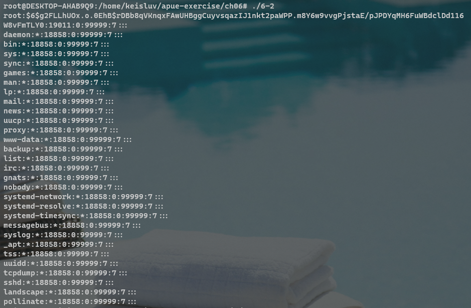
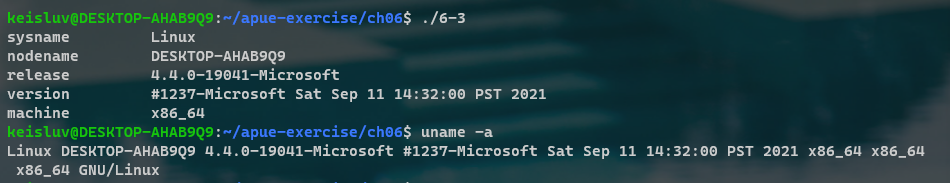
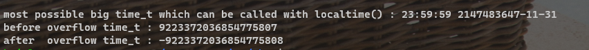
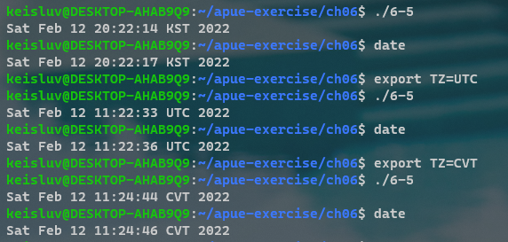

# Chapter 6. System Data Files and Information


---

## 6-1

### Q. 

If the system uses a shadow file and we need to obtain the encrypted password, how do we do so?

### A. 

Get root previlege and read the system's shadow file.

```
$ su - 
Password:
<root login>...

# cat /etc/shadow

```

---


## 6-2

### Q. 

If you have superuser access and your system uses shadow passwords, implement the previous exercise.

### A. 

```C
#include "apue.h"

static char buf[4096];

int main()
{
    FILE *fp = fopen("/etc/shadow", "r");

    while (fgets(buf, 4096, fp) != NULL)
    {
        fputs(buf, stdout);
    }

    exit(0);
}

```



---


## 6-3

### Q. 

Write a program that calls `uname` and prints all the fields in the `utsname` structure.
Compare the output to the output from the uname(1) command.

### A. 



---


## 6-4

### Q. 

Calculate the latest time that can be represented by the `time_t` data type.
After it wraps around, what happens?

### A. 

`time_t` type is `long` type.
So this would be max with `9223372036854775807` - `LONG_MAX`.
When overflow, this go to `-9223372036854775808`.
So system date would be go to far more past from 1970-1-1 00:00:00.



---


## 6-5

### Q. 

Write a program to obtain the current time and print it using `strftime`, so that it looks like the default output from `date(1)`.
Set the `TZ` environment variable to different values and see what happens.


### A. 


