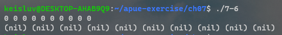

# Chapter 7. Process Environment


---

## 7-1

### Q. 

On an Intel x86 system under Linux, if we execute the program that prints "hello, world" and do not call `exit` or `return`, the termination status of the program — which we can examine with the shell — is 13.
Why?


### A. 

solution ref) the number 13 is the return value of `printf()`.
printf returns the number of character it printed, so "hello, world" has 13 characters.
This behavior is different with system and compiler.

---


## 7-2

### Q. 

When is the output from the `printf`s in Figure 7.3 actually output?

### A. 

case1) if stdout is connected to terminal or is line-buffered, the output would be displayed when it meets newline character.

case2) if stdout is connected to a file or is fully-buffered, the output would be written when the standard I/O cleanup is performed; the cleanup routine flush the buffer and close the streams.

---


## 7-3

### Q. 

Is there any way for a function that is called by `main` to examine the command-line arguments without (a) passing `argc` and `argv` as arguments from `main` to the function or (b) having `main` copy `argc` and `argv` into global variables?


### A. 

solution ref) Most UNIX system has no way of it.
There is no global copy of `argc` and `argv` like `environ`.


---


## 7-4

### Q. 

Some UNIX system implementations purposely arrange that, when a program is executed, location 0 in the data segment is not accessible.
Why?

### A. 

solution ref) this is useful to catch NULL ptr execption. 
Suppose that the program can access to location 0. 
Then, if the system's NULL points to location 0, then NULL ptr actually points real data, data in location 0.
It makes hard to catch NULL ptr, so if system makes location 0 not accessible, if a ptr goes to location 0: this can easily catch.


---


## 7-5

### Q. 

Use the `typedef` facility of C to define a new data type `Exitfunc` for an exit handler.
Redo the prototype for atexit using this data type.


### A. 

```C
typedef void Exitfunc(void);

int atexit(Exitfunc *func);
```


---


## 7-6

### Q. 

If we allocate an array of `long`s using `calloc`, is the array initialized to 0?
If we allocate an array of pointers using `calloc`, is the array initialized to null pointers?

### A. 

Yes.. in my system(wsl 1).

But ISO C standard not guarantee that all 0 bits is not equal to floating point 0 or NULL ptr.

---


## 7-7

### Q. 

In the output from the `size` command at the end of Section 7.6, why aren’t any sizes given for the heap and the stack?


### A. 

`size(1)` command just examine the program file.
The program file has text, data, bss segment, but heap and stack is allocated when the program executed(by `exec`).


---


## 7-8

### Q. 

In Section 7.7, the two file sizes (879443 and 8378) don’t equal the sums of their respective text and data sizes.
Why?


### A. 

solution ref) 
The executable file (a.out) contains symbol table information that can be helpful in debugging a core file. To remove this information, use the strip(1) command. 
Stripping the two a.out files reduces their size to 798,760 and 6,200 bytes.


---


## 7-9

### Q. 

In Section 7.7, why does the size of the executable file differ so dramatically when we use shared libraries for such a trivial program?


### A. 

Because the standard I/O library is so big.

---


## 7-10

### Q. 

At the end of Section 7.10, we showed how a function can’t return a pointer to an automatic variable.
Is the following code correct?

```C
int f1(int val)
{
    int num = 0;
    int *ptr = &num;

    if (val == 0) {
        int val;
        val = 5;
        ptr = &val;
    }

    return (*ptr + 1);
}
```


### A. 

This could be dangerous when if statement is done.
`ptr` points the if block's automatic variable `val` and after the block ends, the `ptr` points invalid location.


---