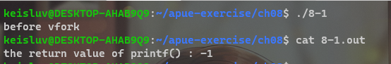
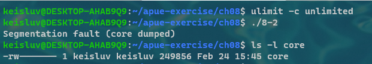
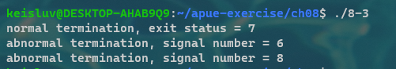
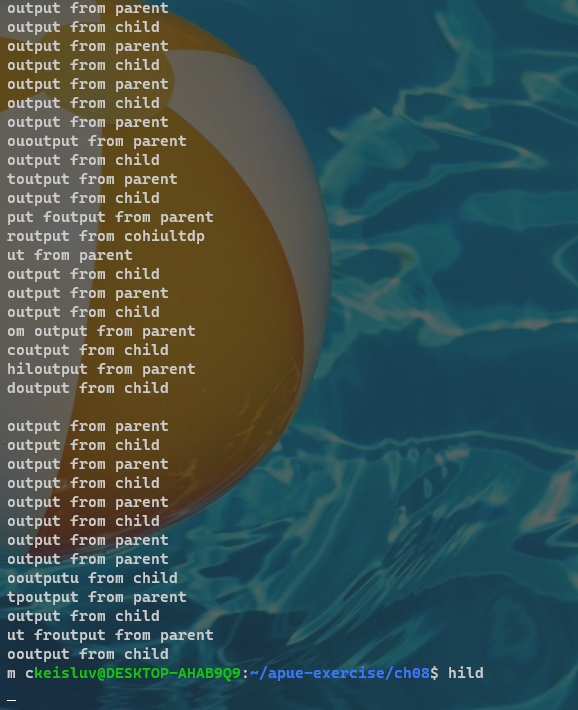
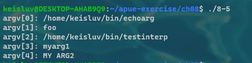
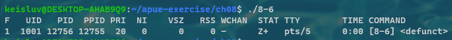
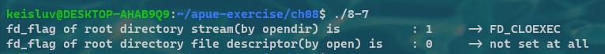

# Chapter 8. Process Control


---

## 8-1

### Q. 

In Figure 8.3, we said that replacing the call to `_exit` with a call to `exit` might cause the standard output to be closed and `printf` to return `−1`.
Modify the program to check whether your implementation behaves this way.
If it does not, how can you simulate this behavior?


### A. 

My system(WSL 1, gcc) doesn't behaves like above, so i implemented.


---

## 8-2

### Q. 

Recall the typical arrangement of memory in Figure 7.6.
Because the stack frames corresponding to each function call are usually stored in the stack, and because after a `vfork` the child runs in the address space of the parent, what happens if the call to `vfork` is from a function other than `main` and the child does a return from this function after the `vfork`?
Write a test program to verify this, and draw a picture of what’s happening.

### A. 

when child is forked in `myfunc()`, the parent save the stack pointer in that location, because after child is exited, the parent would be start the execution from there.
But, after child is returned from `myfunc()`, the `myfunc()` stack frame released.
So, when parent start it's execution, it goes to the saved stack pointer, but that access is not valid access: that stack frame already gone.
This is because the program makes segmentation fault - the access to not allowed memory space.




---

## 8-3


### Q. 

Rewrite the program in Figure 8.6 to use `waitid` instead of `wait`.
Instead of calling `pr_exit`, determine the equivalent information from the `siginfo` structure.


### A. 




---

## 8-4

### Q. 

When we execute the program in Figure 8.13 one time, as in
```bash
$ ./a.out
output from parent
output from child
```
the output is correct.
But if we execute the program multiple times, one right after the other, as in
```bash
$ ./a.out ; ./a.out ; ./a.out
output from parent
ooutput from parent
ouotuptut from child
put from parent
output from child
utput from child
```
the output is not correct.
What’s happening? 
How can we correct this? 
Can this problem happen if we let the child write its output first?


### A. 



That's because there are cases of starting next process before exit of previous process.
The program print to equally stdout, so the two process execution can be mixed.
That depends on the computer's resource usage and process scheduling.

It can be fixed by not allowing the child and parent process to terminate until both child and parent ends their jobs.


---

## 8-5

### Q. 

In the program shown in Figure 8.20, we call `execl`, specifying the pathname of the interpreter file.
If we called `execlp` instead, specifying a `filename` of `testinterp`, and if the directory `/home/sar/bin` was a path prefix, what would be printed as `argv[2]` when the program is run?


### A. 



It's just same, `/home/<my-user-name>/bin/testinterp`.
That's because `execlp` just make pathname with filename and PATH variable, so it is equal to execv with generated pathname call.


---

## 8-6

### Q. 

Write a program that creates a zombie, and then call `system` to execute the `ps(1)` command to verify that the process is a zombie.

### A. 



As above shows, the stat of child process is "Z+", which means zombie process.

---

## 8-7

### Q. 

We mentioned in Section 8.10 that POSIX.1 requires open directory streams to be closed across an exec.
Verify this as follows: call opendir for the root directory, peek at your system’s implementation of the DIR structure, and print the close-on-exec flag.
Then open the same directory for reading, and print the close-on-exec flag.


### A. 



