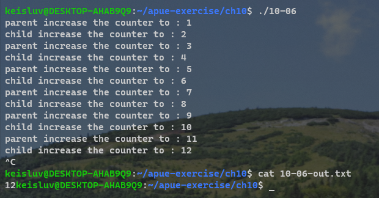
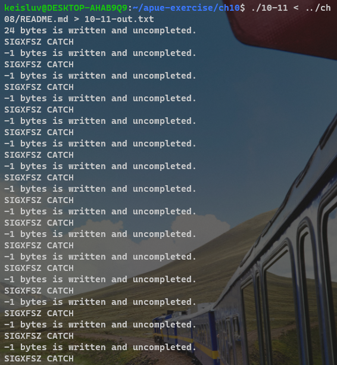
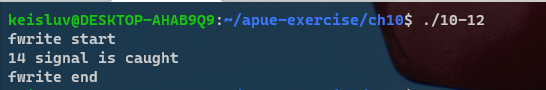

# Chapter 10. Signals


---

## 10-1

### Q. 

In Figure 10.2, remove the `for (;;)` statement. 
What happens and why?

```C
#include "apue.h"

static void sig_usr(int); /* one handler for both signals */
int main(void)
{
    if (signal(SIGUSR1, sig_usr) == SIG_ERR)
        err_sys("can't catch SIGUSR1");
    if (signal(SIGUSR2, sig_usr) == SIG_ERR)
        err_sys("can't catch SIGUSR2");
    
    for (;;)
        pause();
}

static void sig_usr(int signo) /* argument is signal number */
{
    if (signo == SIGUSR1)
        printf("received SIGUSR1\n");
    else if (signo == SIGUSR2)
        printf("received SIGUSR2\n");
    else
        err_dump("received signal %d\n", signo);
}
```


### A. 


After sending signal `SIGUSR1`, the program terminated.
Because `pause()` returned after handling `SIGUSR1` and the main function returned.


---

## 10-2

### Q. 

Implement the `sig2str` function described in Section 10.22.


### A. 


---

## 10-3

### Q. 

Draw pictures of the stack frames when we run the program from Figure 10.9.


### A. 


---

## 10-4

### Q. 

In Figure 10.11, we showed a technique that's often used to set a timeout on an I/O operation using `setjmp` and `longjmp`. 
The following code has also been seen:

```C
signal(SIGALRM, sig_alrm);
alarm(60);
if (setjmp(env_alrm) != 0) {
    /* handle timeout */
    ...
}
...
```
What else is wrong with this sequence of code?


### A. 

There is a race condition.
Consider the situation that kernel executed `alarm(60)` and didn't execute remaining codes while it is busy to run other processes(very low probability).
After 60 seconds elapsed, the kernel send a `SIGARLM` and the signal handler call `longjmp`.
But process didn't execute rest of codes so it didn't yet call `setjmp`, so it's behavior is not defined.


---

## 10-5

### Q. 

Using only a single timer (either `alarm` or the higher-precision `setitimer`), provide a set of functions that allows a process to set any number of timers.


### A. 


---

## 10-6

### Q. 

Write the following program to test the parent–child synchronization functions in Figure 10.24. 
The process creates a file and writes the integer 0 to the file. 
The process then calls fork, and the parent and child alternate incrementing the counter in the file. 
Each time the counter is incremented, print which process (parent or child) is doing the increment.


### A. 




---

## 10-7

### Q. 

In the function shown in Figure 10.25, if the caller catches `SIGABRT` and returns from the signal handler, why do we go to the trouble of resetting the disposition to its default and call `kill` the second time, instead of simply calling `_exit`?


### A. 

solution ref) 
If `_exit` called, the process looked "exited".
It must be noticed by other processes that it is terminated by SIGABRT signal.
So it change to default behavior and send abort signal.


---

## 10-8

### Q. 

Why do you think the `siginfo` structure (Section 10.14) includes the real user ID, instead of the effective user ID, in the `si_uid` field?


### A. 

If the process' effective user ID is not same to real user ID(ex. set-user-id program), `kill` system call would not work if the signal recieving process is not same with effective user ID, same with real user ID.
Because `kill` can send signal to whose effective or real user ID is same with itself of sending process.


---

## 10-9

### Q. 

Rewrite the function in Figure 10.14 to handle all the signals from Figure 10.1. 
The function should consist of a single loop that iterates once for every signal in the current signal mask (not once for every possible signal).


### A. 


---

## 10-10

### Q. 

Write a program that calls sleep(60) in an infinite loop. 
Every five times through the loop (every 5 minutes), fetch the current time of day and print the `tm_sec` field. 
Run the program overnight and explain the results. 
How would a program such as the cron daemon, which runs every minute on the minute, handle this situation?

### A. 


---

## 10-11

### Q. 

Modify Figure 3.5 as follows: 
(a) change `BUFFSIZE` to 100; 
(b) catch the `SIGXFSZ` signal using the `signal_intr` function, printing a message when it's caught, and returning from the signal handler; 
(c) print the return value from `write` if the requested number of bytes wasn't written. 
Modify the soft `RLIMIT_FSIZE` resource limit (Section 7.11) to 1,024 bytes and run your new program, copying a file that is larger than 1,024 bytes. 
(Try to set the soft resource limit from your shell. If you can't do this from your shell, call
setrlimit directly from the program.) 
Run this program on the different systems that you have access to. What happens and why?


### A. 

In WSL 2. gcc.



solution ref)
Under Linux 3.2.0, Mac OS X 10.6.8, and Solaris 10, the signal handler for `SIGXFSZ` is never called.
But write returns a count of 24 as soon as the file's size reaches 1,024 bytes.
When the file's size has reached 1,000 bytes under FreeBSD 8.0, the signal handler is called on the next attempt to write 100 bytes, and the write call returns −1 with errno set to EFBIG ("File too big").
On all four platforms, if we attempt an additional write at the current file offset (the end of the file), we will receive `SIGXFSZ` and write will fail, returning −1 with errno set to `EFBIG`.


---

## 10-12

### Q. 

Write a program that calls `fwrite` with a large buffer (about one gigabyte). 
Before calling `fwrite`, call `alarm` to schedule a signal in 1 second. 
In your signal handler, print that the signal was caught and return. 
Does the call to `fwrite` complete? What's happening?

### A. 

In WSL 2. gcc.



solution ref)
The results depend on the implementation of the standard I/O library: how the `fwrite` function handles an interrupted `write`.
On Linux 3.2.0, for example, when we use the `fwrite` function to write a large buffer, the `fwrite` function calls `write` directly for the same number of bytes.
While in the middle of the `write` system call, the `alarm` fires, but we don’t see the signal until the `write` completes. 
It appears as if the kernel is blocking the signal while we are in the middle of the `write` system call.
In contrast, on Solaris 10, the `fwrite` function calls `write` in 8 KB increments until the entire amount is written. 
When the `alarm` fires, it is caught, interrupting the call to `fwrite`. 
After we return from the signal handler, we return to the loop inside the `fwrite` function and continue writing in 8 KB increments.


---