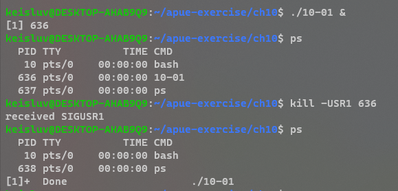
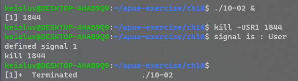
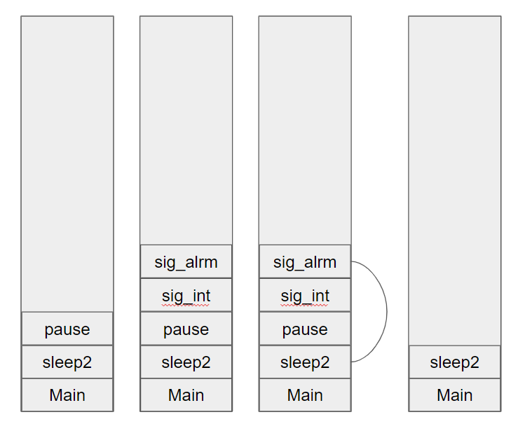

# Chapter 10. Signals


---

## 10-1

### Q. 

In Figure 10.2, remove the `for (;;)` statement. 
What happens and why?

```C
#include "apue.h"

static void sig_usr(int); /* one handler for both signals */
int main(void)
{
    if (signal(SIGUSR1, sig_usr) == SIG_ERR)
        err_sys("can’t catch SIGUSR1");
    if (signal(SIGUSR2, sig_usr) == SIG_ERR)
        err_sys("can’t catch SIGUSR2");
    
    for (;;)
        pause();
}

static void sig_usr(int signo) /* argument is signal number */
{
    if (signo == SIGUSR1)
        printf("received SIGUSR1\n");
    else if (signo == SIGUSR2)
        printf("received SIGUSR2\n");
    else
        err_dump("received signal %d\n", signo);
}
```


### A. 



After sending signal `SIGUSR1`, the program terminated.
Because `pause()` returned after handling `SIGUSR1` and the main function returned.


---

## 10-2

### Q. 

Implement the `sig2str` function described in Section 10.22.


### A. 




---

## 10-3

### Q. 

Draw pictures of the stack frames when we run the program from Figure 10.9.


### A. 



---

## 10-4

### Q. 

In Figure 10.11, we showed a technique that’s often used to set a timeout on an I/O operation using `setjmp` and `longjmp`. 
The following code has also been seen:

```C
signal(SIGALRM, sig_alrm);
alarm(60);
if (setjmp(env_alrm) != 0) {
    /* handle timeout */
    ...
}
...
```
What else is wrong with this sequence of code?


### A. 

There is a race condition.
Consider the situation that kernel executed `alarm(60)` and didn't execute remaining codes while it is busy to run other processes(very low probability).
After 60 seconds elapsed, the kernel send a `SIGARLM` and the signal handler call `longjmp`.
But process didn't execute rest of codes so it didn't yet call `setjmp`, so it's behavior is not defined.


---

## 10-5

### Q. 

Using only a single timer (either `alarm` or the higher-precision `setitimer`), provide a set of functions that allows a process to set any number of timers.


### A. 


---

## 10-6

### Q. 

Write the following program to test the parent–child synchronization functions in Figure 10.24. 
The process creates a file and writes the integer 0 to the file. 
The process then calls fork, and the parent and child alternate incrementing the counter in the file. 
Each time the counter is incremented, print which process (parent or child) is doing the increment.


### A. 


---

## 10-

### Q. 


### A. 


---

## 10-

### Q. 


### A. 


---

## 10-

### Q. 


### A. 


---

## 10-

### Q. 


### A. 


---

## 10-

### Q. 


### A. 


---

## 10-

### Q. 


### A. 


---

## 10-

### Q. 


### A. 


---

## 10-

### Q. 


### A. 


---

## 10-

### Q. 


### A. 


---

## 10-

### Q. 


### A. 


---

## 10-

### Q. 


### A. 


---

## 10-

### Q. 


### A. 


---

## 10-

### Q. 


### A. 


---

