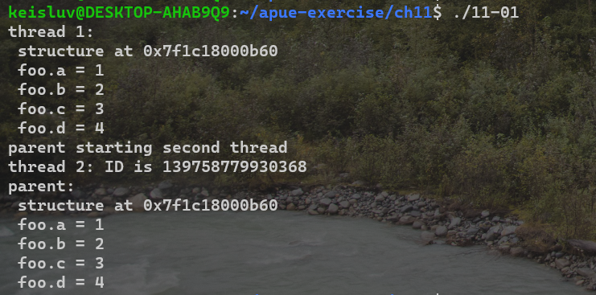

# Chapter 11. Threads

---

## 11-1

### Q. 

Modify the example code shown in Figure 11.4 to pass the structure between the threads properly.

### A. 

---

## 11-2

### Q. 

In the example code shown in Figure 11.14, what additional synchronization (if any) is necessary to allow the master thread to change the thread ID associated with a pending job? 
How would this affect the `job_remove` function?

### A. 

solution ref)
To change the thread ID of a pending job, the reader–writer lock must be held in write mode to prevent anyone from searching the list while the ID is being changed. 
The problem with the way the interfaces are currently defined is that the ID of a job can change between the time that the job is found with job_find and the job is removed from the list by calling job_remove. 
This problem can be solved by embedding a reference count and a mutex inside the job structure and having job_find increment the reference count. 
The code that changes the ID can then avoid any job in the list that has a nonzero reference count.

---

## 11-3

### Q. 

Apply the techniques shown in Figure 11.15 to the worker thread example (Figures 11.1 and 11.14) to implement the worker thread function. 
Don’t forget to update the queue_init function to initialize the condition variable and change the job_insert and job_append functions to signal the worker threads. 
What difficulties arise?

### A. 

solution ref)

First of all, the list is protected by a reader–writer lock, but the condition variable needs a mutex to protect the condition. 
Second, the condition each thread should wait to be satisfied is that there is a job for it to process, so we need to
create a per-thread data structure to represent this condition. 
Alternatively, we can embed the mutex and condition variable in the queue structure, but this means that all worker threads will wait on the same condition. 
If there are many worker threads, we can run into a `thundering herd problem`, whereby many threads are awakened without work to do, resulting in a waste of CPU resources and increased lock contention.

My code has problem of thundering herd problem.

---

## 11-4

### Q. 
Which sequence of steps is correct?

1. Lock a mutex (`pthread_mutex_lock`).
2. Change the condition protected by the mutex.
3. Signal threads waiting on the condition (`pthread_cond_broadcast`).
4. Unlock the mutex (`pthread_mutex_unlock`).

or

1. Lock a mutex (`pthread_mutex_lock`).
2. Change the condition protected by the mutex.
3. Unlock the mutex (`pthread_mutex_unlock`).
4. Signal threads waiting on the condition (`pthread_cond_broadcast`).

### A. 

IMO)

First.

Because before `pthread_cond_broadcast` called, other thread can change the condition.
That's race condition.

solution ref)

It depends on the circumstances. 
In general, both can be correct, but each alternative has drawbacks. 

In the first sequence, the waiting threads will be scheduled to run after we call `pthread_cond_broadcast`. 
If the program is running on a multiprocessor, some threads will run and immediately block because we are still holding the mutex (recall that `pthread_cond_wait` returns with the mutex held). 

In the second sequence, a running thread can acquire the mutex between steps 3 and 4, invalidate the condition, and release the mutex.
Then, when we call `pthread_cond_broadcast`, the condition will no longer be true, and the threads will run needlessly. 
This is why the awakened threads must recheck the condition and not assume that it is true merely because `pthread_cond_wait` returned.

---

## 11-5

### Q. 

What synchronization primitives would you need to implement a barrier? 
Provide an implementation of the `pthread_barrier_wait` function.

### A. 

See `11-05.c`.

---
